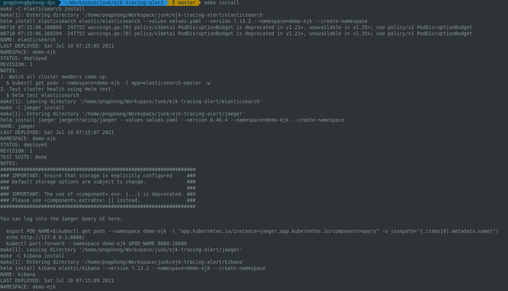
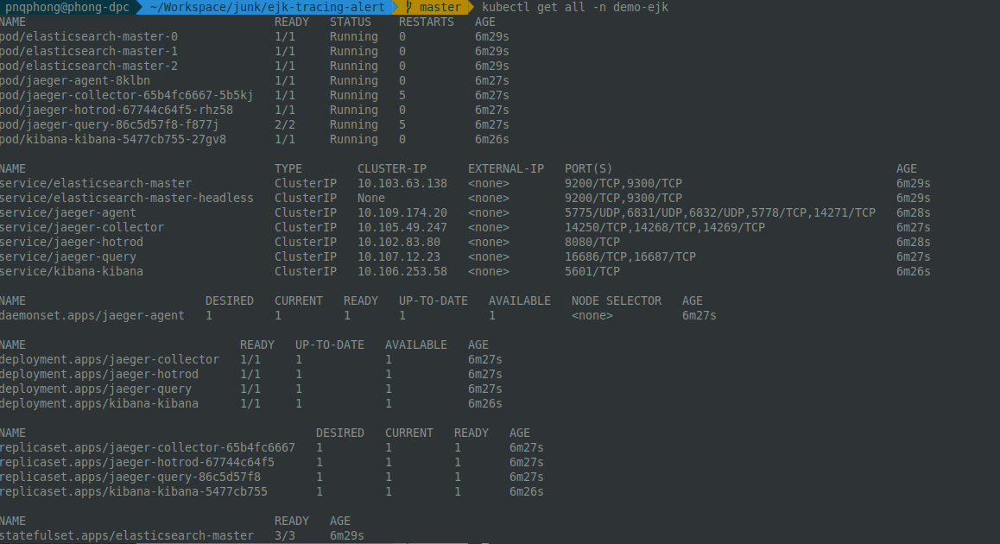

# 
# EJK | Tracing alert

E**J**K is a combination of powerful tools for tracking, storing and visualizing your microservice traces. In this combination, we will use Jaeger, a tracing tool to collect all the traces. These info then will be handled by Elastic Stack include Elasticsearch and Kibana.

## Prerequisite
* Docker / Kubernetes environment [ready](https://kubernetes.io/docs/setup/)!  
  *k8s distribution can be Minikube, Microk8s. I'm using Minikube, you may face few issue when have different distribution.* *
* Helm [v3.6.0+](https://github.com/helm/helm/releases)

## Installation

Use the [Make](https://makefiletutorial.com/) utility to install EJK.

```bash
make install
```



Default namespace `demo-ejk` created with all resources. Let's check it.

```bash
kubectl get all -n demo-ejk
```

If there is no issue, you will see all the `pod is up` & ready for tracing & visualize tracing data.




Or uninstall completely
```bash
make uninstall
```

## Contributing
Pull requests are welcome. For major changes, please open an issue first to discuss what you would like to change.

Some docs is not updated yet:  
* *Create index pattern on Kibana UI.*
* *Alert setting on Kibana UI in case error traces.* 